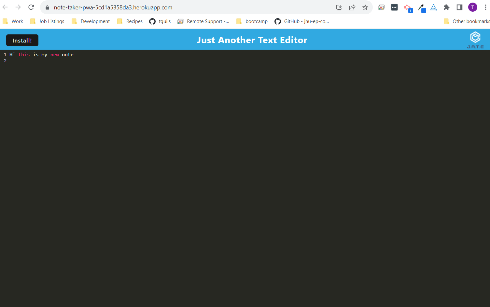

# <Note-Taker-PWA >

## Description

This is a PWA application for a text editor. A text editor typically edits plain text. This application uses PWA technology so that the user is able to use the application offline. 

## Usage

This application can be opened in Heroku. The user will see a screen where they can enter text that saves in the screen. The user will also see an install button which activates the PWA application technologies. When the application is installed the user is able to utilize it offline. To run the application locally type "npm install" and then "npm run start" in the terminal. 

[Deployed Heroku Application](https://note-taker-pwa-5cd1a5358da3.herokuapp.com/)

[Github Test URL](https://github.com/tguils/PWA)

